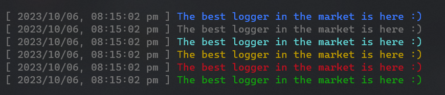
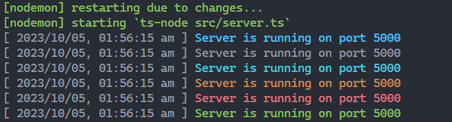
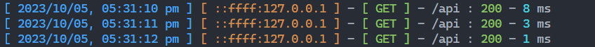
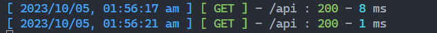
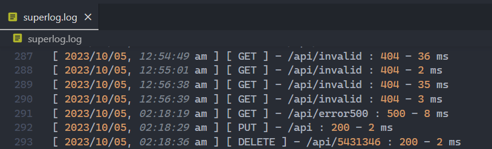

<br/>

<!-- ASCII ART of Logo / Name -->

<div>
<span style='font-family: "Lucida Console";line-height: 14px;font-size: 14px;display: inline-block;'>╔╗&nbsp;╔╗╔╗&nbsp;&nbsp;╔╗&nbsp;&nbsp;&nbsp;&nbsp;&nbsp;&nbsp;&nbsp;&nbsp;&nbsp;╔╗&nbsp;&nbsp;&nbsp;&nbsp;&nbsp;&nbsp;&nbsp;&nbsp;&nbsp;&nbsp;&nbsp;&nbsp;&nbsp;&nbsp;&nbsp;&nbsp;&nbsp;&nbsp;&nbsp;&nbsp;&nbsp;&nbsp;<br>║║&nbsp;║║║║&nbsp;╔╝╚╗&nbsp;&nbsp;&nbsp;&nbsp;&nbsp;&nbsp;&nbsp;&nbsp;║║&nbsp;&nbsp;&nbsp;&nbsp;&nbsp;&nbsp;&nbsp;&nbsp;&nbsp;&nbsp;&nbsp;&nbsp;&nbsp;&nbsp;&nbsp;&nbsp;&nbsp;&nbsp;&nbsp;&nbsp;&nbsp;&nbsp;<br>║║&nbsp;║║║║&nbsp;╚╗╔╝╔═╗╔══╗&nbsp;║║&nbsp;&nbsp;&nbsp;╔══╗╔══╗╔══╗╔══╗╔═╗<br>║║&nbsp;║║║║&nbsp;&nbsp;║║&nbsp;║╔╝╚&nbsp;╗║&nbsp;║║&nbsp;╔╗║╔╗║║╔╗║║╔╗║║╔╗║║╔╝<br>║╚═╝║║╚╗&nbsp;║╚╗║║&nbsp;║╚╝╚╗║╚═╝║║╚╝║║╚╝║║╚╝║║║═╣║║&nbsp;<br>╚═══╝╚═╝&nbsp;╚═╝╚╝&nbsp;╚═══╝╚═══╝╚══╝╚═╗║╚═╗║╚══╝╚╝&nbsp;<br>&nbsp;&nbsp;&nbsp;&nbsp;&nbsp;&nbsp;&nbsp;&nbsp;&nbsp;&nbsp;&nbsp;&nbsp;&nbsp;&nbsp;&nbsp;&nbsp;&nbsp;&nbsp;&nbsp;&nbsp;&nbsp;&nbsp;&nbsp;&nbsp;&nbsp;&nbsp;&nbsp;&nbsp;&nbsp;╔═╝║╔═╝║&nbsp;&nbsp;&nbsp;&nbsp;&nbsp;&nbsp;&nbsp;<br>&nbsp;&nbsp;&nbsp;&nbsp;&nbsp;&nbsp;&nbsp;&nbsp;&nbsp;&nbsp;&nbsp;&nbsp;&nbsp;&nbsp;&nbsp;&nbsp;&nbsp;&nbsp;&nbsp;&nbsp;&nbsp;&nbsp;&nbsp;&nbsp;&nbsp;&nbsp;&nbsp;&nbsp;&nbsp;╚══╝╚══╝&nbsp;&nbsp;&nbsp;&nbsp;&nbsp;&nbsp;&nbsp;<br></span>
</div>

# UltraLogger - The only Logger System you need

### Making your Javascript and Typescript life EZ AF! 🤝🏻🙏🏻

Author: [Arijit Banerjee](#author) <br/>
License: [MIT](./LICENSE.md)



<br/>

## Features:

- Types Support for Intellisense 💡
- Config method to create and setup configs for different features ☸
- Customizable Log Size and Information 💪🏻
- 6 Types of Colorful & Pre-formatted Log Methods - to make your life easy while debugging (we all know logs are superior to debuggers 😏 - who uses debugger anyways eww 🤢🤮)
- API Request Logger - You can use the APIReqLogger method as middleware in your Express Setup (or whatever you use) - life made easy to keep an eye on those freaky api calls 😇
- File Logs - Option to save all those API Logs in a file too - gotta catch those Non-NPCs who was trying to mess up the API - But AFTER THE ☕ Break - the file will keep all them logs safe, don't worry we gotchu 🧐
- **Super Special Feature** - **FATAL LOG**: If you use this for Fatal Error Cases (HIGH SEVERITY), then you have an option to setup a SendGrid Email ApiKey - and our system will notify you, everytime one of these logs were made! 😉
  <br/>( Look, we know we all devs are lazy! 😴 No one got time to keep looking at em logs xD Devs gotta sleep every half an hour too 💤 Just gotta check the 📧 in-case 💩 goes 👇🏻)

<br/>

---

## Setup & Usage:

- **Import**: Import the package - Yall know what this stuff is fs

  For ECMAScript Module a.k.a ESM -

  ```typescript
  import ultraLogger from "ultralogger";
  ```

  For CommonJS a.k.a CJS -

  ```typescript
  const ultraLogger = require("ultralogger");
  ```

- **Config**: Setup your own config with the config method and pass a config object of type ultraLoggerConfig.

  ```typescript
  // UltraLogger Configuration
  //  *** TYPESCRIPT ***

  // Make a Config Object of type ultraLoggerConfig and pass it in the config()
  const config: ultraLogger.ultraLoggerConfig = {
    logType: "SHORT", // You can choose any of these 3 - "FULL" or, "DEV" or "SHORT"
  };

  ultraLogger.config(config);

  // OR,

  // Call the config method and write the config inside the ()
  ultraLogger.config({
    logType: "SHORT", // You can choose any of these 3 - "FULL" or, "DEV" or "SHORT"
  });
  ```

  ```js
  // UltraLogger Configuration
  //  *** JAVASCRIPT ***

  // Make a Config Object and pass it in the config()
  const config = {
    logType: "SHORT", // You can choose any of these 3 - "FULL" or, "DEV" or "SHORT"
  };

  ultraLogger.config(config);

  // OR,

  // Call the config method and write the config inside the ()
  ultraLogger.config({
    logType: "SHORT", // You can choose any of these 3 - "FULL" or, "DEV" or "SHORT"
  });
  ```

    <br />

  Details about the Config Properties:

    <br />

  | **CONFIG PROPERTIES** | **TYPES**            | **OPTIONAL ?** | **VALUES**                                                        | **DEFAULT VALUE**                                                      |
  | --------------------- | -------------------- | -------------- | ----------------------------------------------------------------- | ---------------------------------------------------------------------- |
  | logType               | <code>string</code>  | YES            | <code>"FULL"</code> or <code>"DEV"</code> or <code>"SHORT"</code> | <code>"FULL"</code>                                                    |
  | writeToFile           | <code>boolean</code> | YES            | <code>true</code> or <code>false</code>                           | <code>false</code>                                                     |
  | fileLocation          | <code>string</code>  | YES            | ex: ./folder_that_exists/                                         | - (as 'writeToFile' is false so this is not set - as it is not needed) |
  | fileName              | <code>string</code>  | YES            | file_name.log                                                     | - (as 'writeToFile' is false so this is not set - as it is not needed) |

<br />

- New 6 Types of **Colorful Logs** for your Daily Coding and Debugging sessions: We are bringing you 6 types of different logs through UltraLogger - which you can use instead of your everyday boring console.log() :

  ```typescript
  ultraLogger.log("Server is running on port 5000");
  ultraLogger.muted("Server is running on port 5000");
  ultraLogger.info("Server is running on port 5000");
  ultraLogger.warn("Server is running on port 5000");
  ultraLogger.error("Server is running on port 5000");
  ultraLogger.success("Server is running on port 5000");
  ```

  Sample Output (with the 'logType' set as "DEV"):

  

- Use as **Express Middleware** to Log Requests Data: You can use it like an express middleware.

  ```typescript
  // *** TYPESCRIPT ***
  const app: Application = express();

  app.use(ultraLogger.APIReqLogger());

  // Sample Output: [ 2023/10/05, 05:31:11 pm ] [ ::ffff:127.0.0.1 ] - [ GET ] - /api : 200 - 3 ms
  ```

  ```js
  // *** JAVASCRIPT ***
  const app = express();

  app.use(ultraLogger.APIReqLogger());

  // Sample Output: [ 2023/10/05, 05:31:11 pm ] [ ::ffff:127.0.0.1 ] - [ GET ] - /api : 200 - 3 ms
  ```

  OR,

  If you just want to use UltraLogger as your Express API Request Logger - no need to setup the config. You can pass Log Option through the midleware method itself -

  ```typescript
  // *** TYPESCRIPT ***
  const app: Application = express();

  app.use(ultraLogger.APIReqLogger("FULL")); // Available Options: "FULL", "DEV", "SHORT"

  // Sample Output: [ 2023/10/05, 05:31:11 pm ] [ ::ffff:127.0.0.1 ] - [ GET ] - /api : 200 - 3 ms
  ```

  ```js
  // *** JAVASCRIPT ***
  const app = express();

  app.use(ultraLogger.APIReqLogger("FULL")); // Available Options: "FULL", "DEV", "SHORT"

  // Sample Output: [ 2023/10/05, 05:31:11 pm ] [ ::ffff:127.0.0.1 ] - [ GET ] - /api : 200 - 3 ms
  ```

  If / when you use the APIReqLogger method as middleware without passing any values - "FULL" is set as Default Mode. Ex:

  ```typescript
  app.use(ultraLogger.APIReqLogger()); // We set it as FULL - by Default

  // Sample Output: [ 2023/10/05, 05:31:11 pm ] [ ::ffff:127.0.0.1 ] - [ GET ] - /api : 200 - 3 ms
  ```

  Sample Output Screenshot:

  

  Or use "DEV" as option,

  ```typescript
  app.use(ultraLogger.APIReqLogger("DEV"));

  // Sample Output: [ 2023/10/05, 05:31:10 pm ] [ GET ] - /api : 200 - 8 ms
  ```

  Sample Output Screenshot:

  

  Or use "SHORT" as option,

  ```typescript
  app.use(ultraLogger.APIReqLogger("SHORT"));

  // Sample Output: [ GET ] - /api : 200 - 2 ms
  ```

  

- **Log API Requests Data on File too** - along with logging the API Requests Data, you can log them in a file and save it too if you need it!

  - Setup the Config Properly with the keys and voila
  - Yes, we have Typescript Support so your VSCode will provide you all the juicy auto suggestion 😉

  Ex:

  ```typescript
  // *** TYPESCRIPT ***

  // UltraLogger Configuration
  const config: ultraLogger.ultraLoggerConfig = {
    logType: "DEV",
    writeToFile: true,
    fileLocation: "./",
    fileName: "UltraLogger.log",
  };

  ultraLogger.config(config);
  ```

  ```js
  // ***JAVASCRIPT ***

  // UltraLogger Configuration
  const config = {
    logType: "DEV",
    writeToFile: true,
    fileLocation: "./",
    fileName: "UltraLogger.log",
  };

  ultraLogger.config(config);
  ```

  Or, you can directly create and pass the Config Object while calling the config(). Ex:

  ```typescript
  // Same for both Typescript & Javascript

  ultraLogger.config({
    logType: "DEV",
    writeToFile: true,
    fileLocation: "./",
    fileName: "UltraLogger.log",
  });
  ```

  Screenshot of the Log File:

  

- **FATAL LOG**: COMING SOON

<br/>

---

## Author:

Author : [Arijit Banerjee](https://www.github.com/ArijitCodes)

About : Full Stack Web Developer | Cyber Security Enthusiast | Actor

Social Media : &nbsp;
[ Instagram](https://www.instagram.com/arijit.codes)
&nbsp;
[ LinkedIn](https://www.linkedin.com/in/arijitban)
&nbsp;
[ GitHub](https://github.com/ArijitCodes)
&nbsp;
[ Website](https://iamarijit.dev)

Email: arijit.codes@gmail.com

Website: [iamarijit.dev](https://iamarijit.dev)

---

More info about the project will be updated soon!
